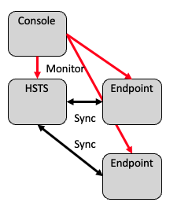

 #Aspera Desktop Client vs HSTE vs HSTS

This document explains differences of features between three components that share some sub components:

- HSTS part of Aspera Enterprise
- HSTE part of Aspera Endpoint
- Aspera Desktop Client

> **Note:** The feature set here reflects the current offering with Aspera Enterprise and Aspera Endpoint. Features were slightly different in earlier part numbers (many options integrated in the base product now)

See also: <https://www.ibm.com/support/pages/transfer-endpoint-and-transfer-server-differences>

## Feature comparison

| Feature                               | License File Tag     | D. Client | HSTE | HSTS |
|---------------------------------------|------------------------------|-----|-----|-----|
| Initiate transfers as a client (1)    |                              | Yes | Yes | Yes |
| GUI: Client features (2)              | desktop_gui_enabled          | Yes | Yes | Yes |
| GUI: Server features (3)              |                              |     | Yes | Yes |
| Receive transfer connection as server |                              |     | Yes | Yes |
| Aspera Sync (async) (4)               | sync2                        |     | Yes | Yes |
| Stream transport                      | stream_enabled               |     | Yes | Yes |
| Watch folders (daemon+GUI)            | watchfolder                  | (10)| Yes | Yes |
| Node API                              | node_enabled                 |     | Yes | Yes |
| Client: Desktop Client (5)            |                              |     | Yes | Yes |
| Client: HSTE                          |                              |     | Yes | Yes |
| Client: HSTS                          |                              |     | Yes | Yes |
| Number of transfer users allowed (6)  | accounts                     | 0   | 2   | Unlimited |
| (unused?)                             | unique_concurrent_logins     | 0   | 2   | Unlimited |
| High Availability (7)                 |                              |     |     | Yes |
| GUI: Share Connection Information (8) | shared_endpoints_enabled     |     |     | Yes |
| Configuration: by groups              | group_configuration_enabled  |     |     | Yes |
| HTTP Fallback (Legacy)                | http_fallback_server_enabled |     |     | Yes |
| Client: Connect (9)                   | connect_enabled              |     |     | Yes |
| Client: Mobile                        | mobile_enabled               |     |     | Yes |
| Client: Cargo                         | cargo_enabled                |     |     | Yes |
| Client: Drive                         | drive_enabled                |     |     | Yes |
| Object Storage (PVCL trap and cloud)  |                              |     |     | Yes |
| Metered licensing (ALEE)              |                              |     |     | Yes |

- **D. Client** is Aspera Desktop Client (free)
- **HSTS** is part of **Aspera Enterprise**
- **HSTE** is part of **Aspera Endpoint**
- Empty table cells means: No
- **Client:** this type of client is allowed to connect to product (column)
- **GUI:** feature of the (java) GUI (`asperascp`)

1. Both Push and Pull. Includes possibility to use command line `ascp` and build a client application using the “Transfer SDK” or “Fasp Manager” API and library.
2. This includes capabilities described in: <https://www.ibm.com/us-en/marketplace/aspera-desktop-client>. This includes the Hot Folder Capability (Windows only, Service AsperaSync)
3. Adds possibility to modify aspera.conf, create watch folders, monitor incoming connections.
4. Async is bundled with HSTS and HSTE
5. Possibility to use Desktop client with Aspera Endpoint is not very clear in License Information.
6. This is a FASP server-side capability, so the Aspera High-Speed Transfer Client does not accept remotely initiated transfers. For HSTE, the 2nd transfer user was initially intended for management only. If added to Aspera Console as a Managed Node as the endpoint type "SSH" to support remote/centralized configuration from Console this consumes 1 transfer user. The meaning of this limitation is "number of docroot/storage root"
7. A cluster of HSTS can be created, but it does not embed all the necessary clustering software (e.g. Load Balancer). One product license is required per cluster member. Aspera Enterprise comes with Proxy Server which provides load balancing. Cluster can be created with or without Redis Sentinel. A cluster of HSTE can also be created, although not formally supported.
8. Sharing includes sharing of SSH Private Keys and Server information between users.
9. Specific clients are enabled through `peer_requirement` in the client license file corresponding to the `enabled` server license flag.
10. This may be integrated in Desktop Client in the future to replace the Hot Folder capability.

## Endpoint

Endpoint is a renaming of the product previously named: Point-to-point and High Speed Transfer Endpoint.

Essentially, the HSTE package contains almost the same components as HSTS, but:

- with limitation on license file (account=2)
- Some client application (licenses) are not allowed to connect
- Some components are missing e.g. no PVCL or ALEE

### Endpoint: HSTE: Limitation 1: number of "docroot" (user accounts)

The limitation concerns:

- The number of user account specified in `aspera.conf`, which limits the number of `docroot`.
- The number of access keys that can be created (since 4.4), which limits the number of `storage root`

Note also that HSTE also prevents the creation of "group" configurations, also preventing the use of more than 2 transfer users.

Nevertheless the following are **not** limited in HSTE:

- the number of remote server to which HSTE can connect to, as transfer client.
- the number of concurrent transfer sessions

### Endpoint: HSTE: Limitation 2: accepted transfer client types

Specific clients are enabled through `peer_requirement` in the client license file corresponding to the `enabled` server license flag.

Refer to <README.license-control.md>

### Endpoint: HSTE: Limitation 3: no object storage, only file system

HSTE does not ship PVCL libraries (cloud and trap), refer to <README.storage.md>

### Endpoint: Limitation 4: no included web app

Although web apps are not included in the Aspera Endpoint product, web apps can be connected to the HSTE using the node API.

For example, although using the web app, the end user cannot transfer files using Aspera Connect Client, it is possible to trigger node-to-node transfers using one of the web UIs: AoC, Shares, Faspex, Console, or the node api.

### Use cases for Endpoint

> **Note:** ALL, i.e. 100%, of use cases for Endpoint are covered by the HSTS included in Aspera Enterprise (or CP4I).

Still, the Endpoint is a very interesting solution for customers: The price is a fraction of the price of Aspera Enterprise, but the transfer performance is identical.

Nevertheless, due to the licensed restrictions, HSTE cannot be used for all use cases where HSTS is used.

Among use cases that can be covered by Endpoint are:

- Server File System synchronization

  

  It's is possible to sell only Endpoints, but in that case there is no web UI for monitoring.
  Typically (but not necessarily) there is a central repository that is sync'ed to remove facilities (satellites).
  Technically, there is one side as client (initiate connection), and the other as server (received the connection).
  Endpoint can be both "super client" (it has the node api) or "mini server" (limitations).
  From the client side point of view, Sync can be:

  - Bi-directional
  - Remote-to-local
  - Local-to-remote

    Also, the number of "docroot" (main sync folder) is limited to 2. So, if the central repository needs to segregate remote client by folder, and there are more than 2 clients, then a central HSTS can be used, and you also get monitoring with Console.

  
